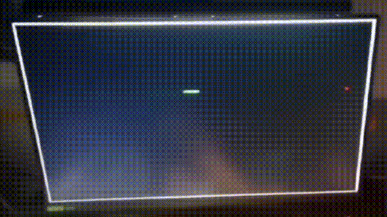
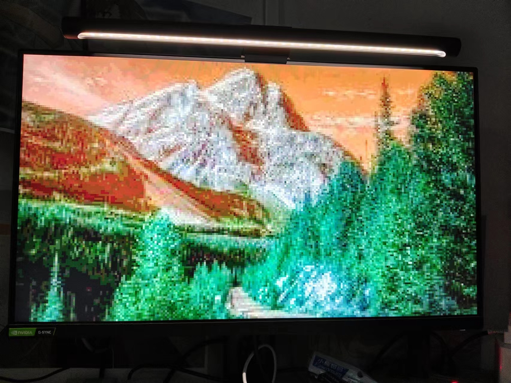

### 基于RISC-V CPU的贪吃蛇小游戏

此仓库为vivado的工程文件目录。

其他文档详见课程报告——硬件综合训练https://github.com/LiuziqiOvO/hustcs_course/tree/master/2022%E7%A7%8B%E7%A1%AC%E4%BB%B6%E7%BB%BC%E5%90%88%E8%AE%AD%E7%BB%83_%E7%BB%84%E5%8E%9F%E8%AF%BE%E8%AE%BE

图为使用的Xilinx FPGA开发板

图为测试VGA显示模块，在显示器上输出图片

